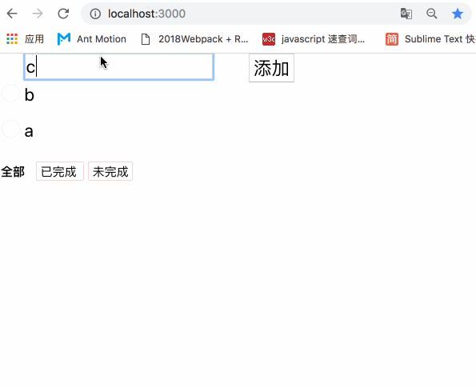

# 简介

该项目用于团队内部圆桌技术分享，用于讲解 “Redux 的简单使用及思想“(https://www.yuque.com/dbox/bk/ik2k8u)


# 技术栈

- 脚手架： create-react-app

- 配置了 redux-devtool


# 项目实现

## 通过组件 state 实现计数器

## 通过 redux 实现计数器

## 通过 redux 、 react-redux 实现 TodoList




# 目录结构

```
├── src
│   ├── index.js
│   ├── index.css
│   ├── App.js
│   ├── components
│   │   ├── constant.js
│   │   ├── filter
│   │   │   ├── filter.js
│   │   │   ├── index.js
│   │   │   ├── link.js
│   │   │   ├── reducer.js
│   │   │   └── style.css
│   │   ├── reducers.js
│   │   └── todos
│   │       ├── TodoItem.js
│   │       ├── TodoList.js
│   │       ├── addTodo.js
│   │       ├── index.js
│   │       ├── reducer.js
│   │       ├── style.css
│   │       └── todos.js
│   └── store
│       ├── index.js
│       ├── configureStore.js
│       ├── configureStore.dev.js
│       ├── configureStore.prod.js
│       └── middlewares.js
└── yarn.lock
```

# 反馈及问题

如有疑问，欢迎提 issue...
